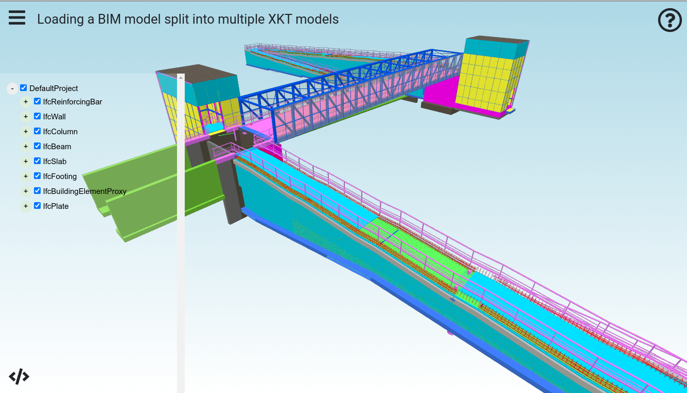

In this tutorial we'll view an IFC model in a xeokit Viewer, after first converted it to 
glTF and JSON metadata files for more efficient loading. 

While converting and loading our model, we'll split the IFC file into multiple glTF and metadata files, for the Viewer 
to load as a batch. This improves memory stability while converting and loading, because it enables the converter and 
Viewer to allocate and deallocate memory in smaller, more recoverable increments. 

[](./../../examples/#SceneModel_build_table/index.html)

* *[Run this example](./../../examples/#SceneModel_build_table/index.html)*

---

<br>

## Converting IFC into glTF and Metadata Files

The first step is to convert our IFC file into a set of glTF geometry and JSON metadata files. For this tutorial, we'll use the Karhumaki Bridge IFC model
from [`http://drumbeat.cs.hut.fi/ifc/`](http://drumbeat.cs.hut.fi/ifc/).

We'll use the [`ifc2gltfcxconverter`](https://www.notion.so/Converting-IFC-to-XKT-using-ifc2gltfcxconverter-a2e0005d00dc4f22b648f1237bc3245d?pvs=21)
CLI tool to do the conversion:

```bash
ifc2gltfcxconverter -i Karhumaki-Bridge.ifc -o model.glb -m model.json -s 100
```

The parameters we provided the tool are:

- `-i` specifies the IFC file to convert
- `-o` specifies the name to prefix on each output glTF file
- `-m` specifies the name to prefix on each JSON metadata file
- `-s` specifies the maximum number of megabytes in each glTF file - smaller value means more output files, lower value
  means less files

The files output by `ifc2gltf` are:

```bash
.
├── model.glb.manifest.json
├── model_1.glb
├── model_1.json
├── model_2.glb
├── model_2.json
├── model_3.glb
├── model_3.json
├── model_4.glb
├── model_4.json
├── model_5.glb
├── model_5.json
├── model_6.glb
├── model_6.json
├── model_7.glb
├── model_7.json
├── model_8.glb
├── model_8.json
├── model_9.glb
├── model_9.json
├── model.glb
└── model.json
```

The `model.glb.manifest.json` manifest looks like this:

```json
{
    "inputFile": "Karhumaki-Bridge.ifc",
    "converterApplication": "ifc2gltfcxconverter",
    "converterApplicationVersion": "2.8.6",
    "conversionDate": "2023-09-08 03:01:39",
    "gltfOutFiles": [
        "model.glb",
        "model_1.glb",
        "model_2.glb",
        "model_3.glb",
        "model_4.glb",
        "model_5.glb",
        "model_6.glb",
        "model_7.glb",
        "model_8.glb",
        "model_9.glb"
    ],
    "metadataOutFiles": [
        "model.json",
        "model_1.json",
        "model_2.json",
        "model_3.json",
        "model_4.json",
        "model_5.json",
        "model_6.json",
        "model_7.json",
        "model_8.json",
        "model_9.json"
    ]
}
```

<br>

## Viewing the glTF and Metadata Files

Now we'll create a Web page containing a xeokit Viewer that views our converted model.

First install the npm modules we need:

````bash
npm install @xeokit/scene
npm install @xeokit/data
npm install @xeokit/modelchunksloader
npm install @xeokit/gltf
npm install @xeokit/metamodel
npm install @xeokit/core
npm install @xeokit/webglrenderer
npm install @xeokit/viewer
npm install @xeokit/cameracontrol
````

Then create an HTML page in `index.html` that contains a canvas element:

````html
<!DOCTYPE html>
<html>
<head>
    <title>xeokit Spinning Box</title>
</head>
<body>
<canvas id="myView1"></canvas>
</body>
<script type="module" src="./index.js"></script>
</html>
````

Then create JavaScript in `index.js` to create the Viewer and view our converted model.

The steps in the JavaScript are as follows:

1. Import the packages we need.
2. Create a Data to hold the IFC semantic data.
3. Create a Viewer with a Scene, a WebGLRenderer and one View.
4. Attach a CameraControl to the View so that we can interact with it using mouse and touch.
5. Create a SceneModel in the Scene.
6. Create a DataModel in the Data.
7. Create a ModelChunksLoader, configured to use loadGLTF load each glTF chunk, and loadMetaModel to load each JSON metadata file.
8. Load our `model.glb.manifest.json` manifest.
9. Use ModelChunksLoader to load the files listed in the manifest into our SceneModel and DataModel.
10. Build the SceneModel and DataModel. The IFC model then appears in the Viewer.

```javascript
 // 1.

import {Scene} from "@xeokit/scene}";
import {Data} from "@xeokit/data}";
import {ModelChunksLoader} from "@xeokit/modelchunksloader}";
import {loadGLTF} from "@xeokit/gltf}";
import {loadMetaModel} from "@xeokit/metamodel}";
import {WebGLRenderer} from "@xeokit/webglrenderer";
import {Viewer} from "@xeokit/viewer";
import {CameraControl} from "@xeokit/cameracontrol";

// 2. 

const data = new Data();

// 3.

const scene = new Scene();

const renderer = new WebGLRenderer({});

const viewer = new Viewer({
    id: "myViewer",
    scene,
    renderer
});

const view = viewer.createView({
    id: "myView",
    elementId: "myCanvas"
});

view.camera.eye = [0, 0, -100];
view.camera.look = [0, 0, 0];
view.camera.up = [0.0, 1.0, 0.0];

// 4. 

new CameraControl(view, {});

// 5.

const sceneModel = scene.createModel({
    id: "myModel"
});

// 6. 

const dataModel = data.createModel({
    id: "myModel"
});

// 7.

const modelChunksLoader = new ModelChunksLoader({
    sceneModelLoader: loadGLTF,
    dataModelLoader: loadMetaModel
});

//  8.

fetch(`model.glb.manifest.json`)
    .then(response => {
        response
            .json()
            .then(modelChunksManifest => {

                // 9.
                
                modelChunksLoader.load({
                    modelChunksManifest,
                    baseDir: ".",
                    sceneModel,
                    dataModel

                }).then(() => { // glTF and JSON files loaded
                    
                    // 10.
                    
                    sceneModel.build();
                    dataModel.build(); 
                    
                    // The Karhumaki Bridge model now appears in our Viewer.
                });
            });
    });
```

